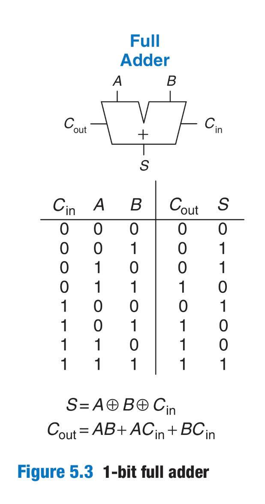

# Homework 4

## `adder32`

Constructing an adder that takes 32-bit inputs was done using a ripple-carry design. To do so, a full-adder taking a total of three inputs (two 32-bit inputs, a carry-in input) and two outputs (one sum output, one carry-out output) was first created. The boolean equation for computing sum and carry-out is found in the image below:    



Although the ripple-carry design has the downside of its proportioal runtime to the number of bits, this was easy to implement using the full adder from Lab 1. 

To test adder32, two types of test cases were used: 1) overflow testing and 2) random testing. 

## `mux32`

Before constructing a 32:1 32-bit mux, there were two possible approaches: 1) a brute-force method of solely using 2:1 32-bit muxes or 2) a recursive approach using 2:1 32-bit muxes. After drawing out the diagram for the 32:1 32-bit mux below, the first approach was taken for it's clarity. 


To test mux32, the sample testbench code for mux4 provided by the instructor was used, but currently unsure of how I can test my mux. Would appreciate feedback/comments on how this can be approached and implemented.

## Running Tests
```console
// Test adder32
$ make test_adder
```

```console
// Test mux32
$ make test_mux
```


The written portion is available [here](https://docs.google.com/document/d/1XybXmTD5-NTJ1gfLq3tYb-wUUDJGZS8xgO912DLf50Q/edit?usp=sharing)

Add a pdf of your written answers to this folder, then use `make clean` then `make submission` to submit!
